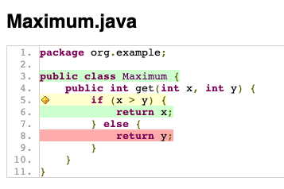
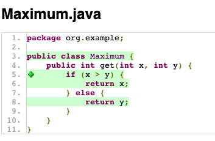

# Testen mit JUnit

Inhalt dieser Vorlesung ist das Testen von Programmen. In diesem Jupyter-Notebook sind dabei die Beispiele rund um JUnit gesammelt. Die in der Vorlesung verwendete Version ist JUnit 5; das Jupyter Notebook hier verwendet noch JUnit 4 aus technischen Gründen (Unterschiede bestehen im Wesentlichen nur (1) in den Imports, (2) Assertion Messages kommen in JUnit 5 als letzter Parameter, (3) `assertEquals` in JUnit 5 kann mit floating point Zahlen umgehen, und (4) `@Before` heisst `@BeforeEach` in JUnit 5.

Betrachten wir die folgende fehlerhafte Java-Klasse.


```Java
class Maximum {
  public int get(int x, int y) {
    if (x > y) {
      return x;
    } else {
      return x; // Bug!
    }
  }
}
```

Wie im Code markiert ist, enthält diese Klasse einen Bug in der `get` Methode. Diese funktioniert korrekt, solange das erste Argument den größeren Wert enthält:


```Java
Maximum max = new Maximum();
max.get(50, 10);
```


    50


Die erwartete Rückgabewert ist 50, und das ist auch was wir bekommen haben -- dieser Fall ist also korrekt implementiert.

Der Fehler tritt auf, wenn das zweite Argument das größere ist:


```Java
max.get(10, 50);
```


    10


An dieser Stelle würden wir auch den Rückgabewert 50 erwarten, haben aber 10 erhalten, was klar falsch ist.

Was wir nun in den letzten paar Zeilen gemacht haben ist genau, was man beim Testen macht: Wir haben eine Instanz der Klasse `Maximum` erzeugt, diese mit verschiedenen Parameterwerten aufgerufen, und das Ergebnis überprüft.

Die Auswahl der konkreten Aufrufe, Parameter, und die Definition der erwarteten Ausgaben sind Dinge, die wir als Entwickler/Tester immer selber machen müssen. Den Ablauf der einzelnen Schritte können wir allerdings automatisieren mit JUnit.

## JUnit Tests

[JUnit](https://junit.org/junit5/) ist ein Framework mit dem automatisierte Tests für Java Code erstellt und ausgeführt werden können. Die aktuelle Version von JUnit ist 5, in diesem Jupyter Notebook verwende ich allerdings JUnit 4, da sich damit aus dem Notebook heraus leichter die Tests ausführen lassen. Bis auf die Paketnamen bei den Imports ändert sich an den Beispielen aber nichts bei der Verwendung mit JUnit 5.

Zunächst benötigen wir die Bibliothek selbst als Abhängigkeit. In einem Softwareprojekt würde man diesen Schritt direkt in der Maven oder Gradle Buildkonfiguration vornehmen.


```Java
%mavenRepo oss-sonatype-snapshots https://oss.sonatype.org/content/repositories/snapshots/
%maven junit:junit:4.13.2
```

Wir benötigen 2 zentrale Imports: Zunächst müssen wir JUnit mitteilen, was Tests sind, dazu brauchen wir die Klasse `Test`.


```Java
import org.junit.Test;
```

Um das Ergebnis in einem Test zu überprüfen benötigen wir noch JUnit Assertions.


```Java
import static org.junit.Assert.*;
```

Nun implementieren wir unseren ersten Test von oben, d.h. den Aufruf mit 50 und 10. Wir definieren dazu eine neue Klasse `MaximumTest` (wie sie heisst ist uns überlassen). Ein Test ist eine Methode die mit der `@Test` Annotation versehen ist, und keine Parameter übernimmt.


```Java
class MaximumTest {

  @Test
  public void testMaximum() {
    Maximum maximum = new Maximum();
    int max = maximum.get(50, 10);
    assertEquals(50, max);
  }
}
```

Die Überprüfung des Ergebnisses passiert mit der Methode `assertEquals`, deren erster Parameter der erwartete Wert ist, und der zweite Wert ist der tatsächliche Wert der Ausführung.

Die Testausführung passiert normalerweise per Button in der IDE oder Kommando des Build-Tools (Maven/Gradle). Im Jupyter Notebook müssen wir das programmatisch machen:


```Java
import org.junit.runner.JUnitCore;
JUnitCore junit = new JUnitCore();
junit.addListener(new  org.junit.internal.TextListener(System.out));
```


```Java
junit.run(MaximumTest.class);
```

    .
    Time: 0.003
    
    OK (1 test)
    


    org.junit.runner.Result@7343aead


Der Output sagt uns, dass ein Test ausgeführt wurde, und dieser hat keinen Fehler gefunden. Erweitern wir also unsere Testklasse mit einem weiteren Test.


```Java
class MaximumTest {

  @Test
  public void testMaximumFirst() {
    Maximum maximum = new Maximum();
    int max = maximum.get(50, 10);
    assertEquals(50, max);
  }
  
  @Test
  public void testMaximumSecond() {
    Maximum maximum = new Maximum();
    int max = maximum.get(10, 50);
    assertEquals(50, max);
  }

}
```

Die beiden Testmethoden haben nun aussagekräftige Namen, mithilfe derer ein Entwickler erkennen kann, was das Ziel des Tests ist. Das ist sehr wichtig sobald ein Projekt mal viele Testklassen und Tests hat.


```Java
junit.run(MaximumTest.class);
```

    .E.
    Time: 0.001
    There was 1 failure:
    1) testMaximumSecond(REPL.$JShell$24B$MaximumTest)
    java.lang.AssertionError: expected:<50> but was:<10>
    	at org.junit.Assert.fail(Assert.java:89)
    	at org.junit.Assert.failNotEquals(Assert.java:835)
    	at org.junit.Assert.assertEquals(Assert.java:647)
    	at org.junit.Assert.assertEquals(Assert.java:633)
    	at REPL.$JShell$24B$MaximumTest.testMaximumSecond($JShell$24B.java:28)
    
    FAILURES!!!
    Tests run: 2,  Failures: 1
    


    org.junit.runner.Result@4986ae33


JUnit berichtet nun, dass einer der beiden ausgeführten Tests fehlgeschlagen ist. Die Zeile mit dem `AssertionError` gibt uns auch einen Hinweis auf das Problem: Es wurde `50` erwartet, aber das Ergebnis war `10`.

Wenn wir mit der Fehlermeldung nicht zufrieden sind, können wir auch eine eigene als ersten Parameter der `assertEquals` einbauen.


```Java
class MaximumTest {

  @Test
  public void testMaximumFirst() {
    Maximum maximum = new Maximum();
    int max = maximum.get(50, 10);
    assertEquals(50, max);
  }
  
  @Test
  public void testMaximumSecond() {
    Maximum maximum = new Maximum();
    int max = maximum.get(10, 50);
    assertEquals("If y is larger than x, then y should be returned.", 50, max);
  }

}
```


```Java
junit.run(MaximumTest.class);
```

    .E.
    Time: 0.001
    There was 1 failure:
    1) testMaximumSecond(REPL.$JShell$24C$MaximumTest)
    java.lang.AssertionError: If y is larger than x, then y should be returned. expected:<50> but was:<10>
    	at org.junit.Assert.fail(Assert.java:89)
    	at org.junit.Assert.failNotEquals(Assert.java:835)
    	at org.junit.Assert.assertEquals(Assert.java:647)
    	at REPL.$JShell$24C$MaximumTest.testMaximumSecond($JShell$24C.java:28)
    
    FAILURES!!!
    Tests run: 2,  Failures: 1
    


    org.junit.runner.Result@7cf9c940


Nun beheben wir den Bug.


```Java
class Maximum {
  public int get(int x, int y) {
    if (x > y) {
      return x;
    } else {
      return y; // Fixed
    }
  }
}
```

Ob unser Fix korrekt ist, können wir überprüfen indem wir unsere Tests nochmal ausführen.


```Java
junit.run(MaximumTest.class);
```

    ..
    Time: 0
    
    OK (2 tests)
    


    org.junit.runner.Result@5cc65fdb


Beide unserer Tests erzeugen sich im ersten Schritt eine Instanz der Klasse `Maximum`. Wir können unsere Testklasse vereinfachen, indem wir dieses Objekt als _Test Fixture_ teilen.


```Java
class MaximumTest {

  private Maximum maximum = new Maximum();

  @Test
  public void testMaximumFirst() {
    int max = maximum.get(50, 10);
    assertEquals(50, max);
  }
  
  @Test
  public void testMaximumSecond() {
    int max = maximum.get(10, 50);
    assertEquals(50, max);
  }

}
```


```Java
junit.run(MaximumTest.class);
```

    ..
    Time: 0.001
    
    OK (2 tests)
    


    org.junit.runner.Result@54468fac


Wenn wir wollen, dass unsere Test Fixture vor jedem Test auf besondere Art neu initialisiert wird, können wir das mithilfe der `@BeforeTest` Annotation machen.


```Java
import org.junit.Before;
```


```Java
class MaximumTest {

  private Maximum maximum;
  
  @Before
  public void setUp() {
    System.out.println("Erzeuge neues Maximum-Objekt");
    maximum = new Maximum();
  }

  @Test
  public void testMaximumFirst() {
    int max = maximum.get(50, 10);
    assertEquals(50, max);
  }
  
  @Test
  public void testMaximumSecond() {
    int max = maximum.get(10, 50);
    assertEquals(50, max);
  }

}
```


```Java
junit.run(MaximumTest.class);
```

    .Erzeuge neues Maximum-Objekt
    .Erzeuge neues Maximum-Objekt
    
    Time: 0.001
    
    OK (2 tests)
    


    org.junit.runner.Result@55a18120


Alle Methoden, die mit `@Before` annotiert sind, werden vor jeder einzelnen Testausführung ausgeführt. Analog dazu gibt es auch `@After`. Methoden, die mit `@BeforeClass` (`@AfterClass`) annotiert sind werden einmal zu Beginn (Ende) der gesamten Ausführung aller Tests ausgeführt. In JUnit 5 sind diese Annotationen umbenannt worden zu `@BeforeEach`/`@AfterEach` und `@BeforeAll`/`@AfterAll`.

Betrachten wir nun eine Variante unserer `Maximum` Klasse, die statt `int`s mit `double`s arbeitet.


```Java
class Maximum {
  public double get(double x, double y) {
    if (x > y) {
      return x;
    } else {
      return y;
    }
  }
}
```

Wir aktualisieren auch unsere Testklasse um mit der geänderten Signatur umzugehen.


```Java
class MaximumTest {

  private Maximum maximum = new Maximum();

  @Test
  public void testMaximumFirst() {
    double max = maximum.get(50.0, 10.0);
    assertEquals(50.0, max);
  }
  
  @Test
  public void testMaximumSecond() {
    double max = maximum.get(10.0, 50.0);
    assertEquals(50, max);
  }

}
```

Dann betrachten wir, was bei der Ausführung passiert.


```Java
junit.run(MaximumTest.class);
```

    .E.E
    Time: 0.001
    There were 2 failures:
    1) testMaximumSecond(REPL.$JShell$24H$MaximumTest)
    java.lang.AssertionError: Use assertEquals(expected, actual, delta) to compare floating-point numbers
    	at org.junit.Assert.fail(Assert.java:89)
    	at org.junit.Assert.assertEquals(Assert.java:669)
    	at org.junit.Assert.assertEquals(Assert.java:658)
    	at REPL.$JShell$24H$MaximumTest.testMaximumSecond($JShell$24H.java:28)
    2) testMaximumFirst(REPL.$JShell$24H$MaximumTest)
    java.lang.AssertionError: Use assertEquals(expected, actual, delta) to compare floating-point numbers
    	at org.junit.Assert.fail(Assert.java:89)
    	at org.junit.Assert.assertEquals(Assert.java:669)
    	at org.junit.Assert.assertEquals(Assert.java:658)
    	at REPL.$JShell$24H$MaximumTest.testMaximumFirst($JShell$24H.java:22)
    
    FAILURES!!!
    Tests run: 2,  Failures: 2
    


    org.junit.runner.Result@24f6ef20


JUnit schimpft darüber, dass wir Fliesskommazahlen mit `assertEquals` vergleichen. Der Grund ist, dass Fliesskommaberechnungen aufgrund von Rundungsfehlern so gut wie nie exakt gleich sind. JUnit bietet für den Vergleich von Fliesskommazahlen eigene Assertions, bei denen man ein Epsilon für die Genauigkeit des Vergleichs angeben kann.


```Java
class MaximumTest {

  private Maximum maximum = new Maximum();

  @Test
  public void testMaximumFirst() {
    double max = maximum.get(50.0, 10.0);
    assertEquals(50.0, max, 0.001);
  }
  
  @Test
  public void testMaximumSecond() {
    double max = maximum.get(10.0, 50.0);
    assertEquals(50, max, 0.001);
  }

}
```


```Java
junit.run(MaximumTest.class);
```

    ..
    Time: 0
    
    OK (2 tests)
    


    org.junit.runner.Result@5accd0d8


Als letzter Hinweis sei noch darauf hingewiesen, dass JUnit eine Vielzahl verschiedener Assertions bietet. Beispielsweise kann man den Wahrheitswert beliebiger Bedingungen mit `assertTrue` und `assertFalse` überprüfen. 


```Java
class MaximumTest {

  @Test
  public void testMaximumSecond() {
    Maximum maximum = new Maximum();
    double max = maximum.get(10.0, 50.0);
    assertTrue(max == 50.0);
    assertFalse(max == 10.0);
  }

}
```


```Java
junit.run(MaximumTest.class);
```

    .
    Time: 0
    
    OK (1 test)
    


    org.junit.runner.Result@7dcb9bb6


Eine Übersicht über vorhandene Assertions gibt es in der [JUnit 4 Dokumentation](https://junit.org/junit4/javadoc/4.8/org/junit/Assert.html) bzw der [JUnit 5 Dokumentation](https://junit.org/junit5/docs/5.8.2/api/org.junit.jupiter.api/org/junit/jupiter/api/Assertions.html).

## Test-Driven Development

Automatisierte Tests haben zwei konträre Anwendungsszenarios: Man erstellt sich Tests auf der Suche nach Fehlern, und behält diese Tests dann um sicherzustellen, dass sich dieser Fehler nicht wieder neu einschleicht; diesen Anwendungsfall nennt man _Regression Testing_. JUnit Tests dienen aber auch dazu beispielhaft zu spezifizieren, was ein Programm können soll. Für diesen Anwendungsfall erstellt man _zuerst_ Tests, und implementiert dann das durch die Tests beschriebene Verhalten. Dies nennt man _Test Driven Development_ (TDD).

Das Vorlesungsbeispiel zu TDD hat als Ziel die Erstellung einer Klasse, die überprüft ob zwei Daten übereinstimmen. Es gibt hierbei 2 Features:
1. Feature: Exakte Übereinstimmung
2. Feature: Wildcard-Matching auf Jahr, Monat, Tag

### Feature 1: Matching

Wir beginnen mit einem Red-Bar Pattern, welches die API unserer Klasse und einen einfachen Anwendungsfall angibt.


```Java
import java.time.LocalDate;
```


```Java
class DatePatternTest {
  @Test
  public void testMatches() {
      DatePattern pattern = new DatePattern(2022, 5, 9);
      LocalDate date = LocalDate.of(2022, 5, 9);
      assertTrue(pattern.matches(date));
  }
}
```


```Java
junit.run(DatePatternTest.class);
```

    .E
    Time: 0.001
    There was 1 failure:
    1) testMatches(REPL.$JShell$39$DatePatternTest)
    jdk.jshell.spi.SPIResolutionException: resolution exception
    	at REPL.$JShell$39$DatePatternTest.<init>($JShell$39.java:21)
    
    FAILURES!!!
    Tests run: 1,  Failures: 1
    


    org.junit.runner.Result@207530af


Wenn wir den Test das erste Mal ausführen, ist das initiale Problem, dass die Klasse `DatePattern` noch überhaupt nicht existiert. Dies lässt sich aber leicht beheben. Die initiale Implementierung soll dabei aber nur das minimale Verhalten haben, um den Test zu bestehen.


```Java
class DatePattern {
  public DatePattern(int year, int month, int day) {
  
  }
  
  public boolean matches(LocalDate otherDate) {
    return true;
  }
}
```


```Java
junit.run(DatePatternTest.class);
```

    .
    Time: 0.001
    
    OK (1 test)
    


    org.junit.runner.Result@468eb539


Nun verfeinern wir Schrittweise unser Feature mit neuen Szenarien, die noch nicht abgedeckt sind. Beispielsweise sollte der Tag von der `matches` Methode überprüft werden, und `false` zurückgeben, wenn hier keine Übereinstimmung herrscht. Beispielsweise so:


```Java
class DatePatternTest {
  @Test
  public void testMatches() {
      DatePattern pattern = new DatePattern(2022, 5, 9);
      LocalDate date = LocalDate.of(2022, 5, 9);
      assertTrue(pattern.matches(date));
  }
  
  @Test
  public void testMatchesOtherDay() {
      DatePattern pattern = new DatePattern(2022, 5, 9);
      LocalDate date = LocalDate.of(2022, 5, 8);
      assertFalse(pattern.matches(date));
  }
}
```


```Java
junit.run(DatePatternTest.class);
```

    .E.
    Time: 0.001
    There was 1 failure:
    1) testMatchesOtherDay(REPL.$JShell$39C$DatePatternTest)
    java.lang.AssertionError
    	at org.junit.Assert.fail(Assert.java:87)
    	at org.junit.Assert.assertTrue(Assert.java:42)
    	at org.junit.Assert.assertFalse(Assert.java:65)
    	at org.junit.Assert.assertFalse(Assert.java:75)
    	at REPL.$JShell$39C$DatePatternTest.testMatchesOtherDay($JShell$39C.java:27)
    
    FAILURES!!!
    Tests run: 2,  Failures: 1
    


    org.junit.runner.Result@61d33063


Nun verfeinern wir die Implementierung von `DatePattern` um auch diesen Test zu bestehen.


```Java
class DatePattern {
  private int day;
  
  public DatePattern(int year, int month, int day) {
      this.day = day;
  }
  
  public boolean matches(LocalDate otherDate) {
    return otherDate.getDayOfMonth() == day;
  }
}
```


```Java
junit.run(DatePatternTest.class);
```

    ..
    Time: 0.001
    
    OK (2 tests)
    


    org.junit.runner.Result@1894a0d7


Wir können ähnliche Tests auch zur Überprüfung des Monats und des Jahres hinzufügen.


```Java
class DatePatternTest {
  @Test
  public void testMatches() {
      DatePattern pattern = new DatePattern(2022, 5, 9);
      LocalDate date = LocalDate.of(2022, 5, 9);
      assertTrue(pattern.matches(date));
  }
  
  @Test
  public void testMatchesOtherDay() {
      DatePattern pattern = new DatePattern(2022, 5, 9);
      LocalDate date = LocalDate.of(2022, 5, 8);
      assertFalse(pattern.matches(date));
  }
  
  @Test
  public void testMatchesOtherMonth() {
      DatePattern pattern = new DatePattern(2022, 5, 9);
      LocalDate date = LocalDate.of(2022, 4, 9);
      assertFalse(pattern.matches(date));
  }

  @Test
  public void testMatchesOtherYear() {
      DatePattern pattern = new DatePattern(2022, 5, 9);
      LocalDate date = LocalDate.of(2021, 5, 9);
      assertFalse(pattern.matches(date));
  }
}
```


```Java
junit.run(DatePatternTest.class);
```

    .E.E..
    Time: 0.002
    There were 2 failures:
    1) testMatchesOtherMonth(REPL.$JShell$39E$DatePatternTest)
    java.lang.AssertionError
    	at org.junit.Assert.fail(Assert.java:87)
    	at org.junit.Assert.assertTrue(Assert.java:42)
    	at org.junit.Assert.assertFalse(Assert.java:65)
    	at org.junit.Assert.assertFalse(Assert.java:75)
    	at REPL.$JShell$39E$DatePatternTest.testMatchesOtherMonth($JShell$39E.java:34)
    2) testMatchesOtherYear(REPL.$JShell$39E$DatePatternTest)
    java.lang.AssertionError
    	at org.junit.Assert.fail(Assert.java:87)
    	at org.junit.Assert.assertTrue(Assert.java:42)
    	at org.junit.Assert.assertFalse(Assert.java:65)
    	at org.junit.Assert.assertFalse(Assert.java:75)
    	at REPL.$JShell$39E$DatePatternTest.testMatchesOtherYear($JShell$39E.java:41)
    
    FAILURES!!!
    Tests run: 4,  Failures: 2
    


    org.junit.runner.Result@4e189622


...und wiederum einfach implementieren.


```Java
class DatePattern {
  private int year;
  private int month;
  private int day;
  
  public DatePattern(int year, int month, int day) {
      this.year = year;
      this.month = month;
      this.day = day;
  }
  
  public boolean matches(LocalDate otherDate) {
    return otherDate.getYear() == year &&
           otherDate.getMonthValue() == month &&
           otherDate.getDayOfMonth() == day;
  }
}
```


```Java
junit.run(DatePatternTest.class);
```

    ....
    Time: 0.001
    
    OK (4 tests)
    


    org.junit.runner.Result@1b12a9ed


Wenn wir keine weiteren Tests mehr für das aktuelle Feature finden, können wir den Code noch verbessern, und dann mit dem nächsten Feature weitermachen. Nachdem unser Code so einfach ist, gehen wir direkt zum nächsten Feature über.

### Feature 2: Wildcards

Wir definieren mit unseren Tests, dass eine `0` für die Jahreszahl dazu führen soll, dass Daten mit beliebigen Jahreszahlen gematched werden sollen.


```Java
class DatePatternTest {
  @Test
  public void testMatches() {
      DatePattern pattern = new DatePattern(2022, 5, 9);
      LocalDate date = LocalDate.of(2022, 5, 9);
      assertTrue(pattern.matches(date));
  }
  
  @Test
  public void testMatchesOtherDay() {
      DatePattern pattern = new DatePattern(2022, 5, 9);
      LocalDate date = LocalDate.of(2022, 5, 8);
      assertFalse(pattern.matches(date));
  }
  
  @Test
  public void testMatchesOtherMonth() {
      DatePattern pattern = new DatePattern(2022, 5, 9);
      LocalDate date = LocalDate.of(2022, 4, 9);
      assertFalse(pattern.matches(date));
  }

  @Test
  public void testMatchesOtherYear() {
      DatePattern pattern = new DatePattern(2022, 5, 9);
      LocalDate date = LocalDate.of(2021, 5, 9);
      assertFalse(pattern.matches(date));
  }
  
  @Test
  public void testWildcardYear() {
      DatePattern pattern = new DatePattern(0, 5, 9);
      assertTrue(pattern.matches(LocalDate.of(2022, 5, 9)));
      assertTrue(pattern.matches(LocalDate.of(1234, 5, 9)));
  }
}
```


```Java
junit.run(DatePatternTest.class);
```

    ..E...
    Time: 0.001
    There was 1 failure:
    1) testWildcardYear(REPL.$JShell$39G$DatePatternTest)
    java.lang.AssertionError
    	at org.junit.Assert.fail(Assert.java:87)
    	at org.junit.Assert.assertTrue(Assert.java:42)
    	at org.junit.Assert.assertTrue(Assert.java:53)
    	at REPL.$JShell$39G$DatePatternTest.testWildcardYear($JShell$39G.java:47)
    
    FAILURES!!!
    Tests run: 5,  Failures: 1
    


    org.junit.runner.Result@3a978d31


Die Implementierung wird wieder verfeinert um diesen Fall abzudecken.


```Java
class DatePattern {
  private int year;
  private int month;
  private int day;
  
  public DatePattern(int year, int month, int day) {
      this.year = year;
      this.month = month;
      this.day = day;
  }
  
  public boolean matches(LocalDate otherDate) {
    return (year == 0 || otherDate.getYear() == year) &&
           otherDate.getMonthValue() == month &&
           otherDate.getDayOfMonth() == day;
  }
}
```


```Java
junit.run(DatePatternTest.class);
```

    .....
    Time: 0.001
    
    OK (5 tests)
    


    org.junit.runner.Result@5529797c


Wir brauchen ähnliche Tests auch für Monat und Tag.


```Java
class DatePatternTest {
  @Test
  public void testMatches() {
      DatePattern pattern = new DatePattern(2022, 5, 9);
      LocalDate date = LocalDate.of(2022, 5, 9);
      assertTrue(pattern.matches(date));
  }
  
  @Test
  public void testMatchesOtherDay() {
      DatePattern pattern = new DatePattern(2022, 5, 9);
      LocalDate date = LocalDate.of(2022, 5, 8);
      assertFalse(pattern.matches(date));
  }
  
  @Test
  public void testMatchesOtherMonth() {
      DatePattern pattern = new DatePattern(2022, 5, 9);
      LocalDate date = LocalDate.of(2022, 4, 9);
      assertFalse(pattern.matches(date));
  }

  @Test
  public void testMatchesOtherYear() {
      DatePattern pattern = new DatePattern(2022, 5, 9);
      LocalDate date = LocalDate.of(2021, 5, 9);
      assertFalse(pattern.matches(date));
  }
  
  @Test
  public void testWildcardYear() {
      DatePattern pattern = new DatePattern(0, 5, 9);
      assertTrue(pattern.matches(LocalDate.of(2022, 5, 9)));
      assertTrue(pattern.matches(LocalDate.of(1234, 5, 9)));
  }
  
  @Test
  public void testWildcardMonth() {
      DatePattern pattern = new DatePattern(2022, 0, 9);
      assertTrue(pattern.matches(LocalDate.of(2022, 4, 9)));
      assertTrue(pattern.matches(LocalDate.of(2022, 7, 9)));
  }
  
  @Test
  public void testWildcardDay() {
      DatePattern pattern = new DatePattern(2022, 5, 0);
      assertTrue(pattern.matches(LocalDate.of(2022, 5, 6)));
      assertTrue(pattern.matches(LocalDate.of(2022, 5, 10)));
  }
}
```


```Java
junit.run(DatePatternTest.class);
```

    .E..E....
    Time: 0.001
    There were 2 failures:
    1) testWildcardDay(REPL.$JShell$39I$DatePatternTest)
    java.lang.AssertionError
    	at org.junit.Assert.fail(Assert.java:87)
    	at org.junit.Assert.assertTrue(Assert.java:42)
    	at org.junit.Assert.assertTrue(Assert.java:53)
    	at REPL.$JShell$39I$DatePatternTest.testWildcardDay($JShell$39I.java:61)
    2) testWildcardMonth(REPL.$JShell$39I$DatePatternTest)
    java.lang.AssertionError
    	at org.junit.Assert.fail(Assert.java:87)
    	at org.junit.Assert.assertTrue(Assert.java:42)
    	at org.junit.Assert.assertTrue(Assert.java:53)
    	at REPL.$JShell$39I$DatePatternTest.testWildcardMonth($JShell$39I.java:54)
    
    FAILURES!!!
    Tests run: 7,  Failures: 2
    


    org.junit.runner.Result@268d12f3


...und entsprechend auch eine verfeinerte Implementierung, die diese beiden Tests erfüllt.


```Java
class DatePattern {
  private int year;
  private int month;
  private int day;
  
  public DatePattern(int year, int month, int day) {
      this.year = year;
      this.month = month;
      this.day = day;
  }
  
  public boolean matches(LocalDate otherDate) {
    return (year == 0 || otherDate.getYear() == year) &&
           (month == 0 || otherDate.getMonthValue() == month) &&
           (day == 0 || otherDate.getDayOfMonth() == day);
  }
}
```


```Java
junit.run(DatePatternTest.class);
```

    .......
    Time: 0
    
    OK (7 tests)
    


    org.junit.runner.Result@7f2325e5


Damit ist auch das zweite Feature fertig, aber besonders schön ist der Code nicht geworden. Der nächste Schritt ist nun, den Code zu verbessern ohne dabei die Funktionalität zu verändern -- was wir mithilfe der Tests jederzeit überprüfen können. Das _Refactoring_ ist etwas, mit dem wir uns in der kommenden Vorlesung genauer beschäftigen werden.


```Java
class DatePattern {
  private int year;
  private int month;
  private int day;
  
  public DatePattern(int year, int month, int day) {
      this.year = year;
      this.month = month;
      this.day = day;
  }
  
  private boolean matchesYear(LocalDate otherDate) {
    return year == 0 || otherDate.getYear() == year;
  }
  
  private boolean matchesMonth(LocalDate otherDate) {
    return month == 0 || otherDate.getMonthValue() == month;
  }
  
  private boolean matchesDay(LocalDate otherDate) {
    return day == 0 || otherDate.getDayOfMonth() == day;
  }
  
  public boolean matches(LocalDate otherDate) {
    return matchesYear(otherDate) && matchesMonth(otherDate) && matchesDay(otherDate);
  }
}
```


```Java
junit.run(DatePatternTest.class);
```

    .......
    Time: 0
    
    OK (7 tests)
    


    org.junit.runner.Result@3beed9b1


## Code Coverage

Testüberdeckung (Code Coverage) ist ein hilfreiches Mittel um abzuschätzen, wie gut der Code getestet ist, und um Schwachstellen in den Tests zu erkennen. In der Vorlesung haben Code Coverage anhand des Kontrollflussgraphen theoretisch definiert, in der Praxis implementieren die meisten IDEs und Build-Werkzeuge Approximationen dieser Kriterien. Beispielsweise verwendet Eclipse die Coverageanalyse-Bibliothek Jacoco. Leider eignet sich Jacoco nur begrenzt zur Demonstration in Jupyter. Wir zeigen kurz das Prinzip, aber für eine bessere Demonstration am besten einfach wie in der Vorlesung demonstriert Tests direkt in Eclipse oder IntelliJ mit Coverage ausführen. Angenommen wir testen weiterhin die `Maximum` Klasse.


```Java
class Maximum {
  public int get(int x, int y) {
    if (x > y) {
      return x;
    } else {
      return y;
    }
  }
}
```

Um Code Coverage zu messen, muss Jacoco den Code mit zusätzlichen Instruktionen instrumentieren, welche protokollieren welche Zeilen ausgeführt wurden. In der IDE ist das ein einfacher Klick, in Jupyter bedarf es leider etwas Boilerplate Code, den wir aber getrost ignorieren können.


```Java
%maven org.jacoco:org.jacoco.core:0.8.10
```


```Java
// Imports für die Analyse in Jupyter
import org.jacoco.core.instr.Instrumenter;
import org.jacoco.core.runtime.IRuntime;
import org.jacoco.core.runtime.LoggerRuntime;
import org.jacoco.core.runtime.RuntimeData;
import java.lang.reflect.Method;
import org.jacoco.core.analysis.Analyzer;
import org.jacoco.core.analysis.CoverageBuilder;
import org.jacoco.core.analysis.IClassCoverage;
import org.jacoco.core.analysis.ICounter;
import org.jacoco.core.data.ExecutionDataStore;
import org.jacoco.core.data.SessionInfoStore;
```

Zunächst wird die instrumentierte Variante der Klasse `Maximum` erstellt.


```Java
final IRuntime runtime = new LoggerRuntime();
final Instrumenter instr = new Instrumenter(runtime);
final String targetName = Maximum.class.getName();
final String resource = "/" + Maximum.class.getName().replace('.', '/') + ".class";

InputStream original =  Maximum.class.getResourceAsStream(resource);
final byte[] instrumented = instr.instrument(original, targetName);
original.close();
```

Das Byte-Array `instrumented` enthält die rohen Bytes der instrumentierten Klasse. Diese müssen noch geladen werden.


```Java
public class MemoryClassLoader extends ClassLoader {

    private final Map<String, byte[]> definitions = new HashMap<String, byte[]>();

    public void addDefinition(final String name, final byte[] bytes) {
        definitions.put(name, bytes);
    }

    @Override
    protected Class<?> loadClass(final String name, final boolean resolve) throws ClassNotFoundException {
        final byte[] bytes = definitions.get(name);
        if (bytes != null) {
            return defineClass(name, bytes, 0, bytes.length);
        }
        return super.loadClass(name, resolve);
    }
}
```


```Java
// In this tutorial we use a special class loader to directly load the
// instrumented class definition from a byte[] instances.
final MemoryClassLoader memoryClassLoader = new MemoryClassLoader();
memoryClassLoader.addDefinition(targetName, instrumented);
final Class<?> targetClass = memoryClassLoader.loadClass(targetName);
```

Die Klasse `targetClass` ist eine modifizierte Variante von `Maximum`, die zusätzliche Instruktionen für Jacoco enthält.


```Java
// Jacoco initialisieren
final RuntimeData data = new RuntimeData();
runtime.startup(data);
```

Wir simulieren nun die Ausführung eines Tests, bei dem der erste Parameter größer als der zweite ist.


```Java
// Entspricht der Ausführung von new Maximum().get(50, 10);

Object targetInstance = targetClass.newInstance();
Method method = targetClass.getMethod("get", int.class, int.class);
method.invoke(targetInstance, 50, 10);
```


    50


Danach kommt die Auswertung durch Jacoco (wie gesagt normal automatisch und ohne dass man sich explizit darum kümmern muss).


```Java
final ExecutionDataStore executionData = new ExecutionDataStore();
final SessionInfoStore sessionInfos = new SessionInfoStore();
data.collect(executionData, sessionInfos, false);
//runtime.shutdown();
```


```Java
final CoverageBuilder coverageBuilder = new CoverageBuilder();
final Analyzer analyzer = new Analyzer(executionData, coverageBuilder);
analyzer.analyzeClass(Maximum.class.getResourceAsStream(resource), "Maximum");
original.close();
```


```Java
void printCounter(final String unit, final ICounter counter) {
    final Integer missed = Integer.valueOf(counter.getMissedCount());
    final Integer total = Integer.valueOf(counter.getTotalCount());
    System.out.printf("%s of %s %s missed%n", missed, total, unit);
}
```


```Java
String getColor(final int status) {
    switch (status) {
    case ICounter.NOT_COVERED:
        return "red";
    case ICounter.PARTLY_COVERED:
        return "yellow";
    case ICounter.FULLY_COVERED:
        return "green";
    }
    return "";
}
```


```Java
for (final IClassCoverage cc : coverageBuilder.getClasses()) {
    System.out.printf("Coverage of class %s%n", cc.getName());

    printCounter("instructions", cc.getInstructionCounter());
    printCounter("branches", cc.getBranchCounter());
    printCounter("lines", cc.getLineCounter());
    printCounter("methods", cc.getMethodCounter());
    printCounter("complexity", cc.getComplexityCounter());
}
```

    Coverage of class REPL/$JShell$12G$Maximum
    2 of 10 instructions missed
    1 of 2 branches missed
    1 of 4 lines missed
    0 of 2 methods missed
    1 of 3 complexity missed


Jacoco erzeugt an dieser Stelle einen Bericht der in etwa so aussieht:



Anhand dieser Information können wir erkennen, dass wir noch keinen Test für den Fall haben, dass der zweite Parameter der größere ist. Führen wir den nun auch noch aus:


```Java
// Test 2
method.invoke(targetInstance, 10, 50);

// Jacoco abschliessen
// final ExecutionDataStore executionData = new ExecutionDataStore();
// final SessionInfoStore sessionInfos = new SessionInfoStore();
data.collect(executionData, sessionInfos, false);
// runtime.shutdown();

// Coverageauswertung
final CoverageBuilder coverageBuilder = new CoverageBuilder();
final Analyzer analyzer = new Analyzer(executionData, coverageBuilder);
analyzer.analyzeClass(Maximum.class.getResourceAsStream(resource), "Maximum");
//original.close();
```


```Java
for (final IClassCoverage cc : coverageBuilder.getClasses()) {
    System.out.printf("Coverage of class %s%n", cc.getName());

    printCounter("instructions", cc.getInstructionCounter());
    printCounter("branches", cc.getBranchCounter());
    printCounter("lines", cc.getLineCounter());
    printCounter("methods", cc.getMethodCounter());
    printCounter("complexity", cc.getComplexityCounter());
}
```

    Coverage of class REPL/$JShell$12G$Maximum
    0 of 10 instructions missed
    0 of 2 branches missed
    0 of 4 lines missed
    0 of 2 methods missed
    0 of 3 complexity missed



